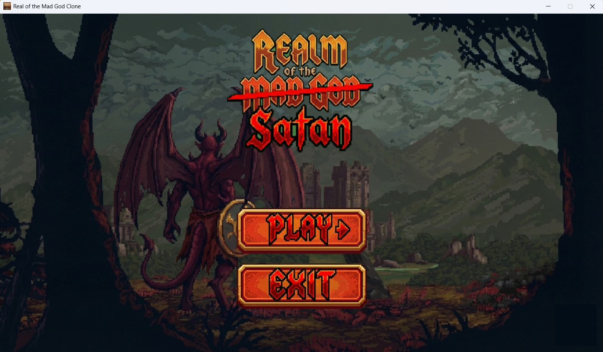
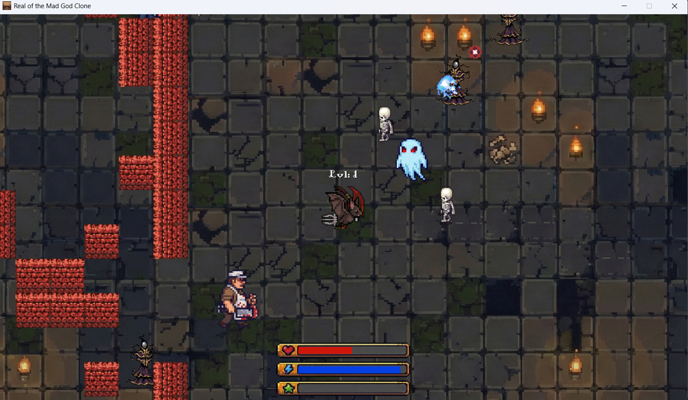

# Realm of The Mad Satan
<hr>

## How to install

1. Clone repository
```sh
git clone https://github.com/N3nT/Realm-of-the-Mad-God
```

2. Install dependencies
```sh
pip install -r requirements.txt
```

3. Run script

```sh
python main.py
```

## Requirements
- [*pygame*](https://www.pygame.org/news) - a free and open-source cross-platform library for the development of multimedia applications like video games using Python.

## Controls

### Movement & Combat
| Action | Input |
| :--- | :--- |
| **Move Character** | `W`, `A`, `S`, `D` |
| **Sprint** | `Shift` |
| **Aim** | `Mouse Cursor` |
| **Primary Attack** | `Left Mouse Button` |
| **Special Attack** | `Right Mouse Button` |

### System
| Action | Input |
| :--- | :--- |
| **Start Game** | `SPACE` (in Menu) |
| **Restart Game** | `R` (on Game Over screen) |
| **Return to Menu** | `ESC` |


## Save file
Save file is in format json. You can change stats in this file.

```json
{
    "level": 3,
    "xp": 5,
    "xp_to_next_level": 306,
    "health": 200,
    "max_health": 200,
    "energy": 120,
    "max_energy": 120,
    "position": {
        "x": 1626,
        "y": 489
    },
    "game_time": 28021
}
```

## Preview

1. Main menu

2. In game

3. End screen
